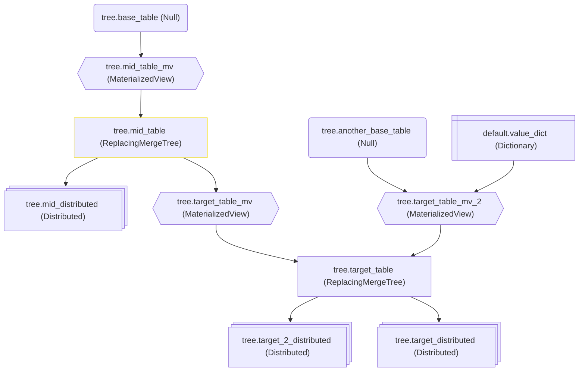

# ClickHouse table graph


Tool for visualizing dependencies between ClickHouse tables.
## Table of contents
- [Overview](#overview)
- [How to use](#how-to-use)
  - [CLI application](#cli-application)
    - [Pre-requisites](#pre-requisites)
    - [Build and run](#build-and-run)
  - [Packages](#packages)
    - [cmd/chtg-cli main package](#cmdchtg-cli-main-package)
    - [table package](#table-package)
    - [clickhouse package](#clickhouse-package)
    - [graph package](#graph-package)
    - [mermaid package](#mermaid-package)
## Overview
The main goal of this tool is to visualize [ClickHouse](https://github.com/ClickHouse/ClickHouse) table dependencies.
When you have big number of tables in your ClickHouse database, it can be really hard to understand how they are connected and what is the data flow between them.

With this tool you can easily visualize tables dependencies and understand the data flow in your ClickHouse database.
Thanks to [mermaid](https://github.com/mermaid-js/mermaid), an awesome tool for generating diagrams, the resulting graph looks attractive and can be easily added to your markdown documentation.


Current version of the tool extracts dependencies from:
* `create_table_query` column in `system.tables` table:
  * Materialized view **Target table** is extracted from the `TO` clause of the create query
  * **Joined tables** are extracted from the `JOIN` clause of the create query, if materialized view `select` query contains `JOIN` clause
  * **Distributed table** is extracted from the `Distributed` engine definition in the create query
  * **Dictionary** is extracted from the dictionary functions like `dictGet`, `dictGetString`, `dictGetUInt64` in the create query 
* `dependencies_table` column in `system.tables`

This tool is written in [Go](https://go.dev/) and functionality is well split into separate packages, so it can be easily integrated into other Go projects or used as a standalone CLI tool.

## How to use

### CLI application

The CLI application allows you to generate mermaid flowchart from ClickHouse tables dependencies from command line.

#### Pre-requisites
- Go 1.22 or higher
- ClickHouse server running and credentials to access it

#### Build and run binaries
 - checkout the repository
 - run `go mod download` to download dependencies
 - run `go build -o bin/ ./...` to build the CLI application. This command will build the binaries `chtg-cli` and save it to the `bin` directory. Note: please check Go [documentation](https://go.dev/doc/tutorial/compile-install) for details.
 - run `./bin/chtg-cli` to start the CLI application

#### Run tests and development version
- checkout the repository
- run `go mod download` to download dependencies
- run `go run main.go` to start the CLI application
- run `go test ./...` to run all tests
- change the current directory to the `cmd/chtg-cli` 
- run `go run . --clickhouse-table <db.table>` to start the CLI application

Use the following flags to specify configuration options:
```
-clickhouse-host string
   Clickhouse host to get tables from. Optional. Default value is "localhost"
-clickhouse-port string
   Clickhouse port. Optional. Default value 9000
-clickhouse-table string
   Clickhouse full table name in format <database>.<table> to get dependencies for. Required.
-clickhouse-user string
   Clickhouse username. Optional. Default value is "" (empty string)
-secure bool
   Use secure connection to ClickHouse server. Optional. Default value is false
-skip-tls-verify bool
   Skip TLS verification. Optional. Default value is false
-out-file string
   Output file name. Optional. If not specified, the output will be printed to the console.
-out-format string
   Output format. Default value "mermaid-html". Possible values: "mermaid-html", "mermaid-md".
-mermaid-theme string
   Mermaid theme. Optional. Default value is 'default'. See https://mermaid-js.github.io/mermaid/#/theming
-table-highlight-color string
   Highlight color for the selected clickhouse table. E.g. '#ff5757' or 'red'. Optional. If not specified, the table will not be highlighted. See https://mermaid.js.org/syntax/flowchart.html?id=flowcharts-basic-syntax#styling-a-node
-help
   Show help
```
For example:
```bash
./bin/chtg-cli -clickhouse-host localhost -clickhouse-port 9000 -clickhouse-user my_user -clickhouse-table my_db.my_table -out-file my-table-graph.html -out-format mermaid-html -table-highlight-color '#f4e022'
```
The command above will ask for the ClickHouse password and generate the mermaid flowchart diagram for the `my_db.my_table` table and save it to the `my-table-graph.html` file.

More example you can find in my [blog post about this tool](https://nocql.dev/posts/clickhouse-table-graph-tool/)

### Packages
#### cmd/chtg-cli main package
The `main` package contains the CLI application. Run the main method from this package to start the CLI application and generate mermaid digraph from ClickHouse tables dependencies. See more in [CLI application](#cli-application) section.
#### table package
The `table` package contains the definition of the ClickHouse table. This definition is used to represent the table in the table graph. All other modules uses this definition.
#### clickhouse package
The `clickhouse` package contains the ClickHouse client implementation. It allows you to connect to ClickHouse server and get tables metadata.

In order to get tables metadata from ClickHouse server, you need to create a new ClickHouse server struct with the server URL and credentials:
```go
chServer := clickhouse.Server{
    Address:  "localhost:9000",
    Username: "ch_user",
    Password: "ch_password",
}
```
Then you can get tables information from the ClickHouse server by calling the `GetTables()` method:
```go
tables, err := chServer.GetTables()
```
The `GetTables()` method returns a slice of `table.Info` structs, where each item contains information about the table fetched from the `system.tables` table.

The slice of tables can be used to generate table graph by using methods from the `graph` package.
#### graph package
The `graph` package contains the implementation of the table graph. It allows you to generate graph of tables dependencies from the slice of `table.Info`.
To do this, you need to 
- create a new `graph.Graph` struct with `graph.New()`
- populate the graph by adding tables with `graph.LinksBuilder.AddTable(table table.Info)`
- get the table links for the specified table by calling `graph.LinksBuilder.TableLinks(tableKey table.Key)`

The `TableLinks()` traverses the graph in direction as dependencies order:
- The source table for a materialized view is a parent node for the materialized view. The materialized view is a child node for the source table.
- The target table for a materialized view is a child node for the materialized view. The materialized view is a parent node for the target table.
- If a table has related distributed table, the distributed table is a child node and the table. The table is a parent node for the distributed table.

The result of the `TableLinks()` contains the following links:
- all links for child nodes which can be reached from the specified table when going down by dependencies
- all links for parent nodes which can be reached from the specified table when going up by dependencies

It **does not contain** links for the nodes which are not connected to the specified table at all or are connected as dependencies (children nodes) for parent nodes, because they are not relevant for the data flow related to the specified table.

Code example:
```go
myTableGraph := graph.New() // create new graph
for _, t := range tables {
    // add tables to the graph. These tables will be analyzed for dependencies
    myTableGraph.AddTable(t)
}
// get table links which are relevant for the data flow related to the specified table
tableLinks, err := myTableGraph.TableLinks(table.Key{Database: chDatabase, Name: chTable}) 
```
In the code above the `tableLinks` is a variable of type `graph.Links` which contains slice of links and additional information like the table for which the links are generated and map with all tables information. 

#### mermaid package
Once you have the table links, you can generate mermaid flowchart diagram from them by using the `mermaid` package.
To do it, use the `mermaid.Flowchart(graphLinks graph.Links, options FlowchartOptions) string` function.
This function will return [flowchart diagram](https://mermaid.js.org/syntax/flowchart.html) as a string in mermaid Markdown format.
You may provide options for the flowchart diagram to customize its appearance, e.g. flowchart orientation and additional settings:
```go
type FlowchartOptions struct {
	// Orientation is the orientation of the flowchart graph.
	// "TB", "BT", "LR", "RL" see mermaid documentation: https://mermaid.js.org/syntax/flowchart.html#direction
	Orientation Orientation
	// IncludeEngine is a flag to include the engine information in the node label.
	// When true, the engine information is included.
	IncludeEngine bool
}
```

Code example:
```go
mermaidFlowchart := mermaid.Flowchart(*tableLinks, mermaid.FlowchartOptions{Orientation: mermaid.TB, IncludeEngine: true, InitialTableHighlightColor: "#f4e022"})
```
will generate the flowchart diagram in the top-to-bottom orientation with the engine information included in the node label:
```
flowchart TB
test_db.target_table_mv@{ shape: hex, label: "test_db.target_table_mv (MaterializedView)" } --> test_db.target_table@{ shape: rect, label: "test_db.target_table (ReplacingMergeTree)" }
test_db.input_table@{ shape: rounded, label: "test_db.input_table (Null)" } --> test_db.target_table_mv@{ shape: hex, label: "test_db.target_table_mv (MaterializedView)" }
style test_db.input_table stroke:#f4e022
```

This diagram can be easily added to your markdown documentation and rendered. 
For example GitHub will render the mermaid diagram if you specify `mermaid` syntax for the code block:
````
```mermaid
```
````
The above Markdown diagram is rendered by GitHub:
```mermaid
flowchart TB
test_db.target_table_mv@{ shape: hex, label: "test_db.target_table_mv (MaterializedView)" } --> test_db.target_table@{ shape: rect, label: "test_db.target_table (ReplacingMergeTree)" }
test_db.input_table@{ shape: rounded, label: "test_db.input_table (Null)" } --> test_db.target_table_mv@{ shape: hex, label: "test_db.target_table_mv (MaterializedView)" }
style test_db.input_table stroke:#f4e022
```

In case if you do not want to embed the diagram into your markdown documentation, you can wrap the diagram into a html document which will include mermaid.js library. So you can share it or use as a standalone page:

```go
html = mermaid.Html(mermaidFlowchart, mermaid.HtmlOptions{})
```
The code above will return html document as a string with the diagram and all necessary scripts and styles to render it.
The fist parameter is the string with the mermaid diagram in Markdown format, the second parameter is the options for the html document. With the options you can specify document title and custom mermaid library URL.

## Future plans
- Add visualization for dependencies on Dictionaries
- Add visualization for users and roles dependencies
## Contributing
If you have any ideas or want to contribute to this project, feel free to create an issue or pull request. Your contribution is highly appreciated.
## Authors
- [Mikhail Baksheev](https://github.com/mbaksheev)


